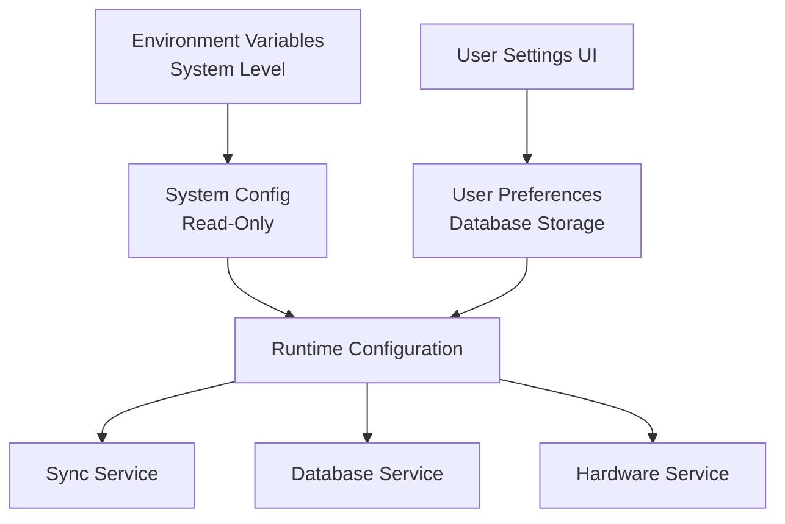

# POS System Configuration Guide

This document outlines the comprehensive configuration system for the POS application, with **clear separation** between system-level settings (environment variables) and user-configurable preferences.

## 📋 Configuration Architecture

The POS system uses a **two-tier configuration approach**:

1. **🔧 System Configuration** - Environment variables for deployment/system settings (not user-configurable)
2. **👤 User Settings** - Configurable via Settings UI, stored in database (user preferences)

## 🔧 System Configuration (Environment Variables)

These are **deployment/system-level settings** that should be configured once per environment and are **NOT user-configurable**:

Copy `config.env.example` to `.env` and customize these values:

### API Configuration (Deployment-Specific)

```env
VITE_API_BASE_URL=http://127.0.0.1:8001/api
VITE_API_TIMEOUT_MS=10000
```

- **Purpose**: Different URLs for dev/staging/production
- **Why System-Level**: Deployment infrastructure concern

### Development Configuration

```env
VITE_DEV_MODE=false
VITE_DEBUG_SYNC=false
VITE_SAMPLE_DATA_ON_EMPTY=true
```

- **Purpose**: Development and debugging flags
- **Why System-Level**: Developer/deployment concern

### Performance Configuration (System Resources)

```env
VITE_IMAGE_CACHE_ENABLED=true
VITE_MAX_CONCURRENT_SYNCS=3
```

- **Purpose**: System resource management
- **Why System-Level**: Server/hardware capacity concern

### Hardware Detection (System-Level)

```env
VITE_CASH_DRAWER_AVAILABLE=true
VITE_RECEIPT_PRINTER_AVAILABLE=true
```

- **Purpose**: What hardware is detected/available on this system
- **Why System-Level**: Hardware detection, not user preference

## ⚙️ User Settings (Configurable via Settings UI)

These settings can be modified by users through the **System Settings dialog**:

### 🔄 Synchronization Settings

- **Sync Interval**: 1-60 minutes (default: 5 minutes)
- **Auto Sync Enabled**: Enable/disable automatic synchronization

### 💾 Backup Settings

- **Backup Interval**: 5 minutes to 24 hours (default: 30 minutes)
- **Auto Backup Enabled**: Enable/disable automatic backups
- **Max Backups to Keep**: Number of backup files to retain (default: 10)

### 🔌 Hardware Settings

- **Cash Drawer Enabled**: Enable/disable cash drawer (if available)
- **Receipt Printer Enabled**: Enable/disable receipt printing (if available)

### 🏪 Store Information

- **Store Name**: Business name for receipts
- **Store Address**: Physical address
- **Store Phone**: Contact number
- **Receipt Header/Footer**: Custom receipt text
- **Default Tax Rate**: Percentage for tax calculations

### 🎨 UI Preferences

- **Theme**: Light, Dark, or System
- **Language**: Interface language
- **Currency**: Display currency format

## 🔄 Configuration Flow



## 📁 File Structure

```
electron-app/
├── config.env.example          # System-level environment template
├── src/
│   ├── services/
│   │   └── configService.js     # Configuration management (system + user)
│   └── components/
│       └── SystemSettingsDialog.jsx  # User settings UI
├── electron/
│   └── services/
│       ├── sync-service.js      # Uses both system config & user settings
│       └── database-service.js  # Uses both system config & user settings
└── CONFIGURATION.md             # This documentation
```

## 🔌 API Reference

### ConfigService Methods

```javascript
import configService from "@/services/configService";

// Get system configuration (read-only)
const apiUrl = configService.get("api.baseUrl"); // System config
const debugMode = configService.get("dev.debugSync"); // System config

// Get user settings (modifiable)
const syncInterval = configService.get("syncIntervalMinutes"); // User setting

// Save user settings (only user preferences, not system config)
await configService.saveUserSettings({
	syncIntervalMinutes: 10,
	autoSyncEnabled: false,
	storeName: "My Store",
});

// Listen for user settings changes
const unsubscribe = configService.addListener((userSettings) => {
	console.log("User settings changed:", userSettings);
});
```

### Sync API (via window.syncApi)

```javascript
// User-configurable sync settings
await window.syncApi.setSyncInterval(10); // 10 minutes
await window.syncApi.setAutoSyncEnabled(false); // Disable auto-sync

// Manual sync operations
await window.syncApi.performDeltaSync();
await window.syncApi.startPeriodicSync();
await window.syncApi.stopPeriodicSync();
```

### Database API (via window.dbApi)

```javascript
// User settings management
const userSettings = await window.dbApi.getSettings();
await window.dbApi.saveSettings({
	syncIntervalMinutes: 5,
	autoBackupEnabled: true,
	storeName: "My Business",
});
```

## 🎛️ Settings UI

### SystemSettingsDialog Tabs

1. **Sync** - Sync interval and auto-sync toggle
2. **Backup** - Backup frequency and retention
3. **Hardware** - Enable/disable available hardware
4. **Store** - Store information and receipt settings
5. **Interface** - Theme, language, currency preferences

### Example Usage

```jsx
import SystemSettingsDialog from "@/components/SystemSettingsDialog";

function App() {
	const [settingsOpen, setSettingsOpen] = useState(false);

	return (
		<>
			<Button onClick={() => setSettingsOpen(true)}>Settings</Button>
			<SystemSettingsDialog
				isOpen={settingsOpen}
				onClose={() => setSettingsOpen(false)}
			/>
		</>
	);
}
```

## 🚀 Best Practices

### 1. Development Setup

```bash
cp config.env.example .env
# Edit .env with your development system settings
```

### 2. Production Deployment

- Set environment variables in your deployment environment
- API URLs, timeouts, and resource limits are deployment concerns
- Users configure their preferences via the Settings UI

### 3. Clear Separation

- **Environment Variables** = "How the system operates" (deployment)
- **User Settings** = "How the user wants it to behave" (preferences)

## 🔒 Security Considerations

1. **API Keys**: Stored securely in database, never in environment variables
2. **System Settings**: Read-only for users, controlled by deployment
3. **User Settings**: Validated and sanitized in the UI
4. **Default Fallbacks**: System provides working defaults for all settings

## 🐛 Troubleshooting

### Setting Not Updating

- **System settings** (env vars): Restart application after changing `.env`
- **User settings**: Check Settings UI and database connectivity

### Sync Issues

- Check system-level API URL in environment variables
- Verify user sync preferences in Settings UI
- Enable debug mode: `VITE_DEBUG_SYNC=true`

## 📊 **Perfect Separation Achieved** ✅

| **System Level (Environment)** | **User Level (Settings UI)** |
| ------------------------------ | ---------------------------- |
| API Base URL                   | Sync Interval                |
| API Timeout                    | Auto-Sync Enabled            |
| Debug Flags                    | Backup Interval              |
| Max Concurrent Syncs           | Hardware Enable/Disable      |
| Hardware Detection             | Store Information            |
| Performance Settings           | UI Preferences               |

This separation ensures that:

- **Developers** control deployment/system concerns via environment variables
- **Users** control their preferences via the intuitive Settings UI
- **No confusion** about what can be changed where
